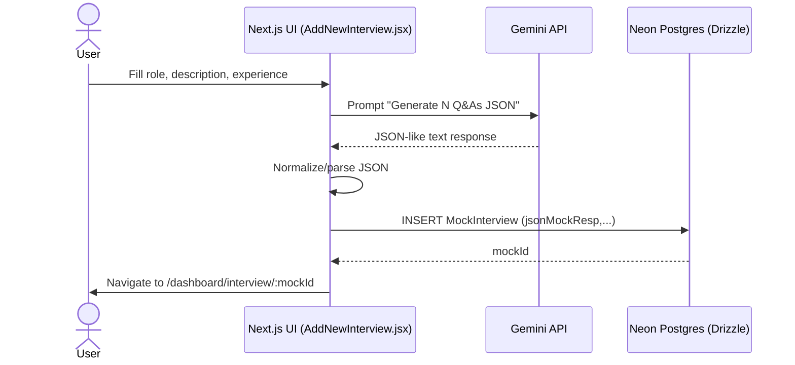
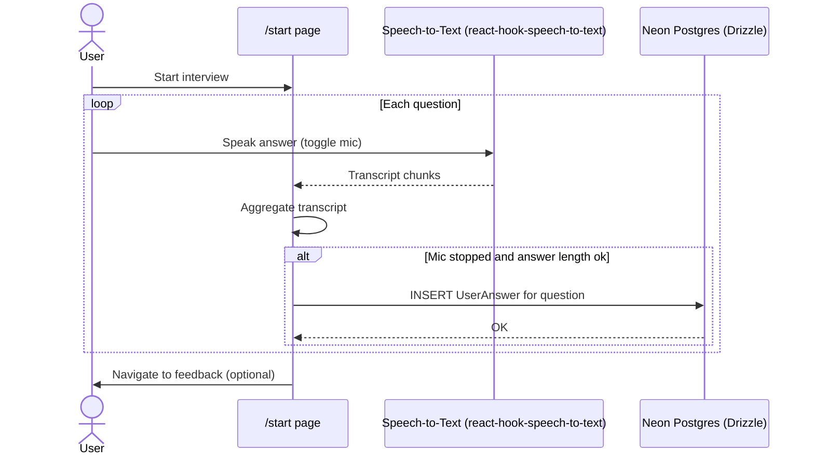
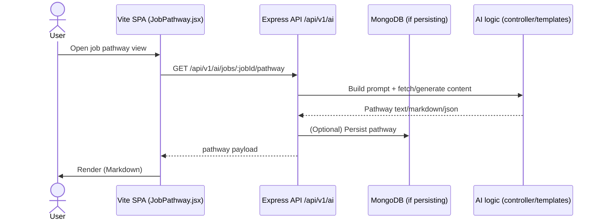
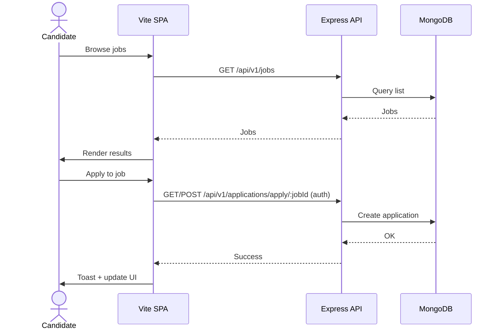

# CareerLens Monorepo

This repository contains three applications working together:

- `ai_mock_interview` – Next.js app for AI mock interviews using Gemini, Clerk auth, and Neon Postgres via Drizzle.
- `backend` – Node/Express REST API for jobs, companies, applications, users, and AI helpers; MongoDB + Cloudinary.
- `frontend` – Vite/React SPA for candidate/admin experiences consuming the backend APIs; Redux state management.

## Repository structure

```text
/Users/pavankumar/Documents/Programming/CareerLens
├─ ai_mock_interview/                # Next.js app for AI mock interviews
├─ backend/                          # Express API for job marketplace + AI helpers
└─ frontend/                         # Vite/React SPA consuming backend APIs
```

## System context

```mermaid
flowchart LR
  subgraph Users
    U1[Candidate User]
    U2[Admin User]
  end

  subgraph NextApp[ai_mock_interview (Next.js)]
    NUI[Pages + Client Components]
    NDB[(Neon Postgres\nDrizzle ORM)]
    NAuth[Clerk Auth]
    NGem[Google Generative AI\n(Gemini)]
  end

  subgraph Backend[backend (Express API)]
    BE[REST Controllers]
    BDB[(MongoDB)]
    BAI[AI Helper Logic]
    BCloud[Cloudinary]
  end

  subgraph SPA[frontend (Vite/React)]
    FUI[SPA Screens + Redux]
  end

  U1 --> NUI
  U2 --> FUI

  NUI <-->|CRUD interview data| NDB
  NUI -->|Prompts| NGem
  NUI -->|Auth| NAuth

  FUI -->|REST calls| BE
  BE -->|CRUD| BDB
  BE -->|Upload| BCloud
  FUI -->|AI pathway| BE
  BE -->|Prompting/LLM usage (optional)| BAI
```

## Component/Deployment view

```mermaid
graph TD
  subgraph Monorepo
    A[ai_mock_interview\nNext.js App Router] --> A1[UI Components (Shadcn/Lucide)]
    A --> A2[Feature: Mock Interview]
    A2 --> A2a[Gemini Client]
    A2 --> A2b[Drizzle Repo (MockInterview, UserAnswer)]
    A --> A3[Clerk Integration]
    A --> A4[Neon HTTP Driver]

    B[backend\nExpress] --> B1[Routes (jobs, companies, applications, users, ai)]
    B --> B2[Controllers]
    B --> B3[Mongoose Models]
    B --> B4[Cloudinary Utils]
    B --> B5[Mongo Connection]

    C[frontend\nVite/React SPA] --> C1[Screens (Home, Jobs, Admin)]
    C --> C2[Redux Slices]
    C --> C3[Hooks (fetchers)]
    C -->|REST| B
  end
```

## Workflows

### Create mock interview (Next.js)



### Interview session (Next.js)



### AI Career Pathway (SPA + backend)



### Job browsing and applying (SPA + backend)



## Data stores

- ai_mock_interview: Neon Postgres via Drizzle HTTP driver.
- backend: MongoDB with Mongoose.

## Auth

- ai_mock_interview: Clerk.
- backend/frontend: Cookie/JWT (see `middlewares/isAuthenticated.js`).

## Environments

- ai_mock_interview: `NEXT_PUBLIC_GEMINI_API_KEY`, `NEXT_PUBLIC_DRIZZLE_DB_URL`, `NEXT_PUBLIC_INTERVIEW_QUESTION`, Clerk envs.
- backend: MongoDB URI, Cloudinary keys, JWT secret, etc.
- frontend: API base URLs in `src/utils/constant.js`.
