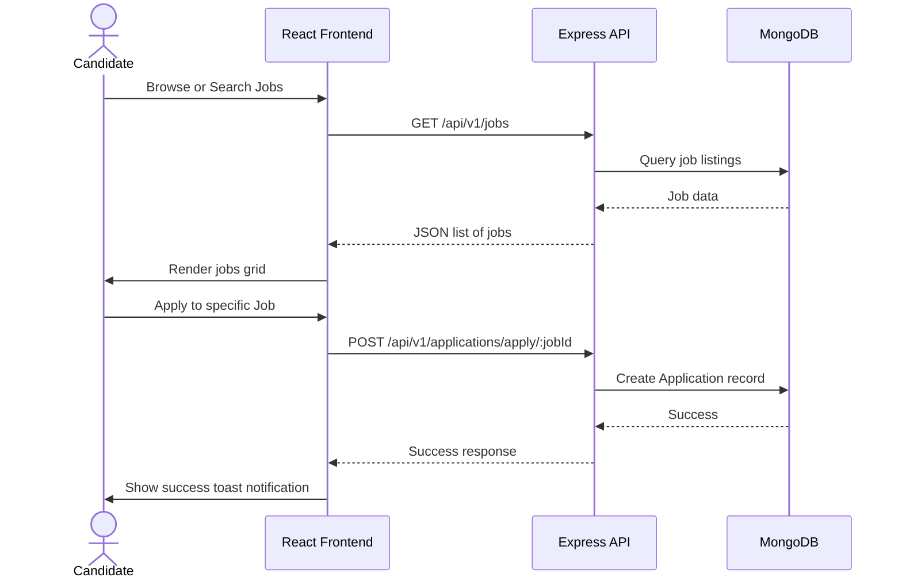
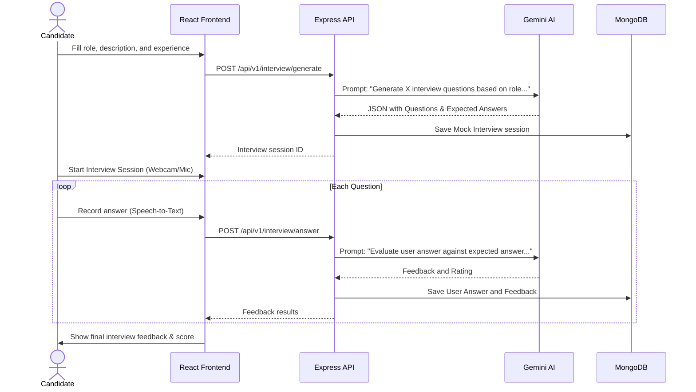
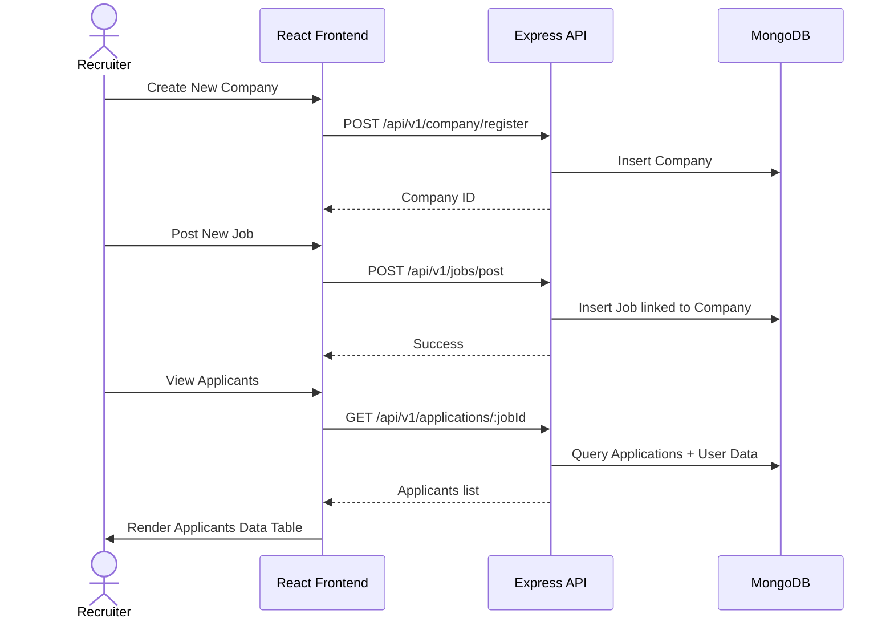
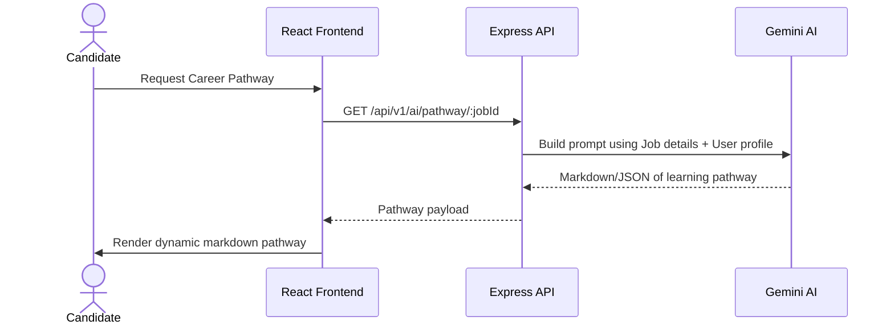

# CareerLens

CareerLens is a comprehensive, AI-powered career development platform and job portal. It connects candidates with recruiters while offering advanced AI features like personalized career pathways and interactive AI mock interviews.

## System Architecture

CareerLens follows a modern client-server architecture with two main components:

- **frontend**: A Vite-powered React Single Page Application (SPA) serving both Candidates and Recruiters. It handles job searching, application management, admin dashboards, and the interactive AI mock interview experience (webcam/microphone integration).
- **backend**: A Node.js and Express REST API powered by MongoDB. It manages the business logic, user authentication, file uploads (via Cloudinary), and integrates with Google's Gemini AI (via Langchain) for mock interview question generation and career pathway insights.

### Directory Structure

```text
/CareerLens
├─ backend/      # Express REST API, MongoDB models, AI integrations
└─ frontend/     # React SPA, Redux state, UI components, Mock Interview logic
```

## Core Workflows

### 1. Job Browsing & Applying Workflow


```mermaid
sequenceDiagram
  actor Candidate
  participant SPA as React Frontend
  participant API as Express API
  participant DB as MongoDB

  Candidate->>SPA: Browse or Search Jobs
  SPA->>API: GET /api/v1/jobs
  API->>DB: Query job listings
  DB-->>API: Job data
  API-->>SPA: JSON list of jobs
  SPA->>Candidate: Render jobs grid

  Candidate->>SPA: Apply to specific Job
  SPA->>API: POST /api/v1/applications/apply/:jobId
  API->>DB: Create Application record
  DB-->>API: Success
  API-->>SPA: Success response
  SPA->>Candidate: Show success toast notification
```

### 2. AI Mock Interview Workflow


```mermaid
sequenceDiagram
  actor Candidate
  participant SPA as React Frontend
  participant API as Express API
  participant AI as Gemini AI
  participant DB as MongoDB

  Candidate->>SPA: Fill role, description, and experience
  SPA->>API: POST /api/v1/interview/generate
  API->>AI: Prompt: "Generate X interview questions based on role..."
  AI-->>API: JSON with Questions & Expected Answers
  API->>DB: Save Mock Interview session
  API-->>SPA: Interview session ID

  Candidate->>SPA: Start Interview Session (Webcam/Mic)
  loop Each Question
    Candidate->>SPA: Record answer (Speech-to-Text)
    SPA->>API: POST /api/v1/interview/answer
    API->>AI: Prompt: "Evaluate user answer against expected answer..."
    AI-->>API: Feedback and Rating
    API->>DB: Save User Answer and Feedback
    API-->>SPA: Feedback results
  end
  SPA->>Candidate: Show final interview feedback & score
```

### 3. Recruiter Job Management Workflow


```mermaid
sequenceDiagram
  actor Recruiter
  participant SPA as React Frontend
  participant API as Express API
  participant DB as MongoDB

  Recruiter->>SPA: Create New Company
  SPA->>API: POST /api/v1/company/register
  API->>DB: Insert Company
  API-->>SPA: Company ID
  
  Recruiter->>SPA: Post New Job
  SPA->>API: POST /api/v1/jobs/post
  API->>DB: Insert Job linked to Company
  API-->>SPA: Success
  
  Recruiter->>SPA: View Applicants
  SPA->>API: GET /api/v1/applications/:jobId
  API->>DB: Query Applications + User Data
  API-->>SPA: Applicants list
  SPA->>Recruiter: Render Applicants Data Table
```

### 4. AI Career Pathway Workflow


```mermaid
sequenceDiagram
  actor Candidate
  participant SPA as React Frontend
  participant API as Express API
  participant AI as Gemini AI

  Candidate->>SPA: Request Career Pathway
  SPA->>API: GET /api/v1/ai/pathway/:jobId
  API->>AI: Build prompt using Job details + User profile
  AI-->>API: Markdown/JSON of learning pathway
  API-->>SPA: Pathway payload
  SPA->>Candidate: Render dynamic markdown pathway
```

## Features

- **For Candidates:**
  - Search and filter jobs by location, salary, and role.
  - Apply to jobs with a single click (resume parsing support).
  - Practice with AI-driven mock interviews, utilizing speech-to-text and webcam.
  - Generate personalized career learning pathways using AI.
- **For Recruiters (Admins):**
  - Manage company profiles and post job listings.
  - View applicant details, download resumes, and manage application statuses (Accepted/Rejected).
  - View dashboard analytics (charts and stats for applications and jobs).

## Getting Started

To run the full stack locally, you need to set up both the backend and frontend.

1. Clone the repository.
2. Navigate to `/backend`, configure your `.env` file, and run `npm install` followed by `npm run dev`.
3. Navigate to `/frontend`, configure your `.env` file (if necessary), and run `npm install` followed by `npm run dev`.

Please see the respective `README.md` files in the `frontend` and `backend` directories for detailed setup instructions.
