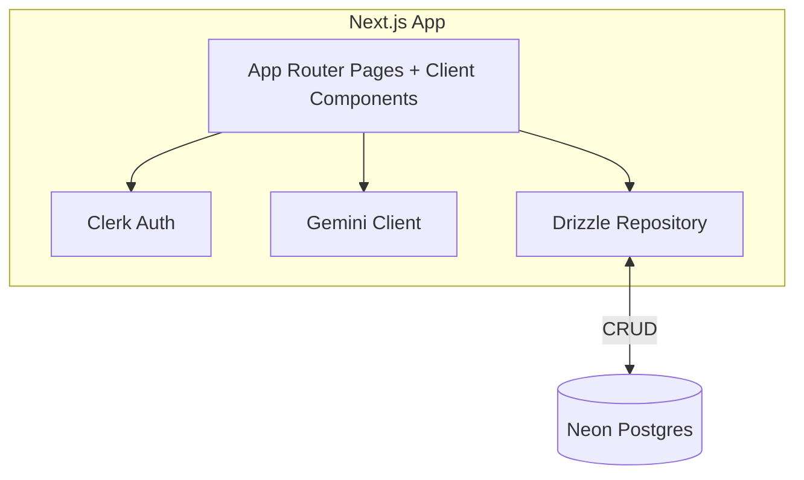
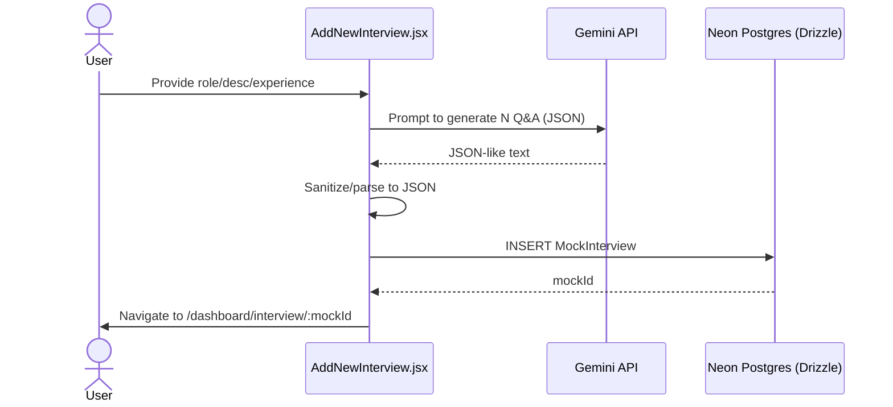
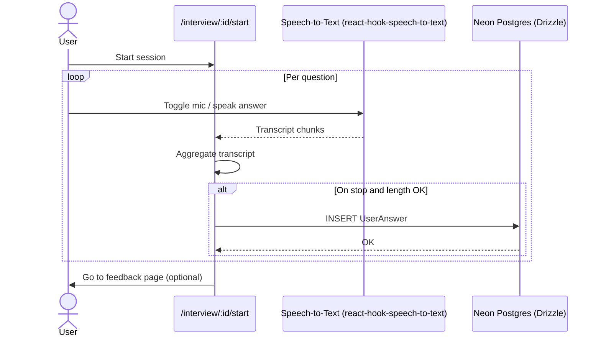

# ai_mock_interview (Next.js)

Next.js application for AI mock interviews using Gemini, Clerk authentication, and Neon Postgres via Drizzle.

## Architecture

## Workflows

### Create mock interview

### Interview session & answer capture

## Key paths

- Components: `app/dashboard/_components/*`
- Interview flow: `app/dashboard/interview/[interviewId]/*`
- Gemini client: `utils/GeminiAIModel.js`
- Drizzle DB: `utils/db.js`, schema in `utils/schema.js`

## Env vars

- `NEXT_PUBLIC_GEMINI_API_KEY` – Gemini API key
- `NEXT_PUBLIC_DRIZZLE_DB_URL` – Neon Postgres HTTP URL
- `NEXT_PUBLIC_INTERVIEW_QUESTION` – Number of questions to generate
- Clerk environment variables
