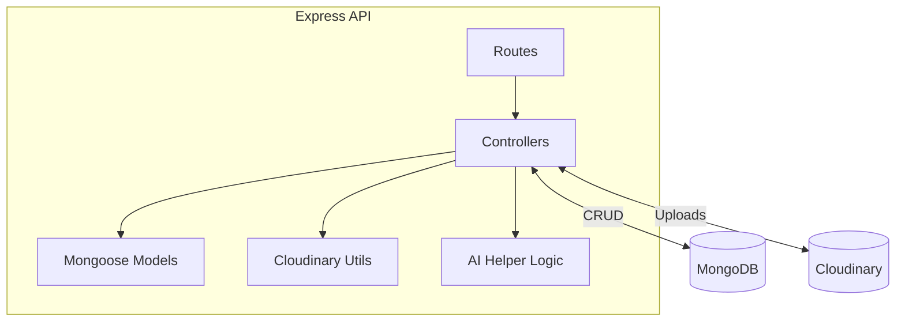
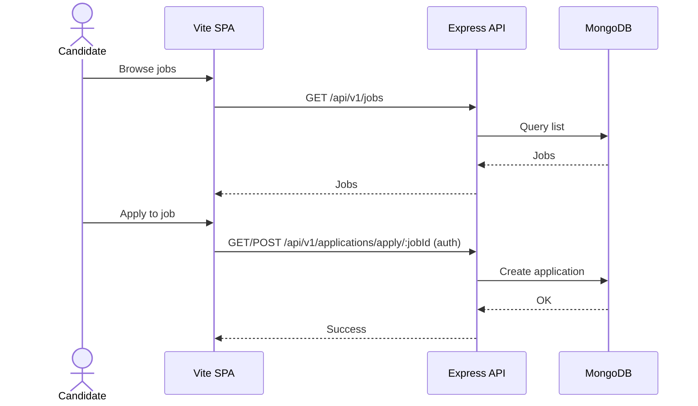
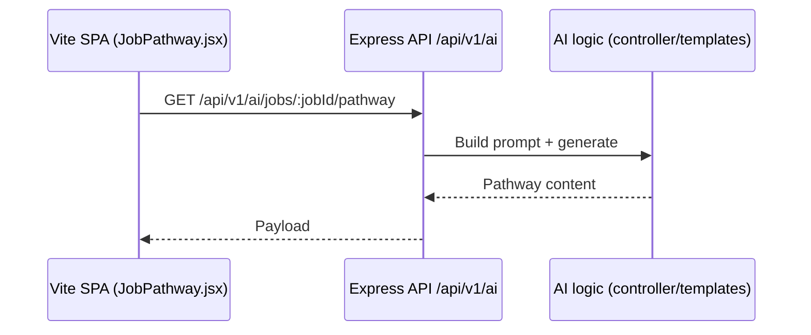

# Backend (Express API)

Express REST API serving job marketplace features and AI helper endpoints.

## Architecture

## Workflows

### Job browsing and applying

### AI pathway endpoint

## Key paths

- Routes: `routes/*.js`
- Controllers: `controllers/*.js`
- Models: `models/*.js`
- Utils: `utils/`

## Env vars

- MongoDB URI, JWT secret
- Cloudinary: cloud name, API key/secret
