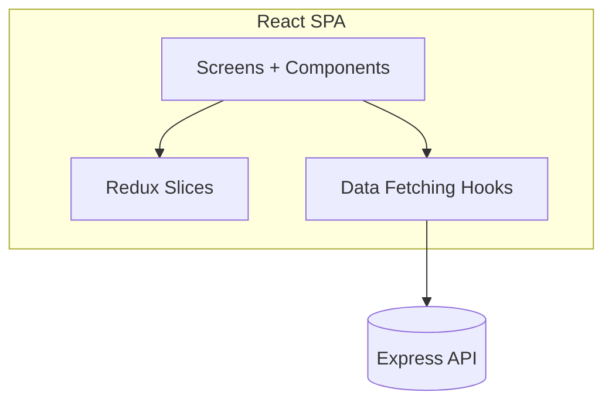
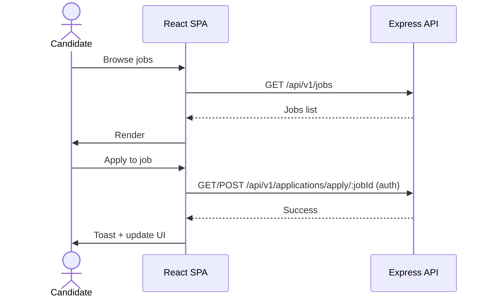
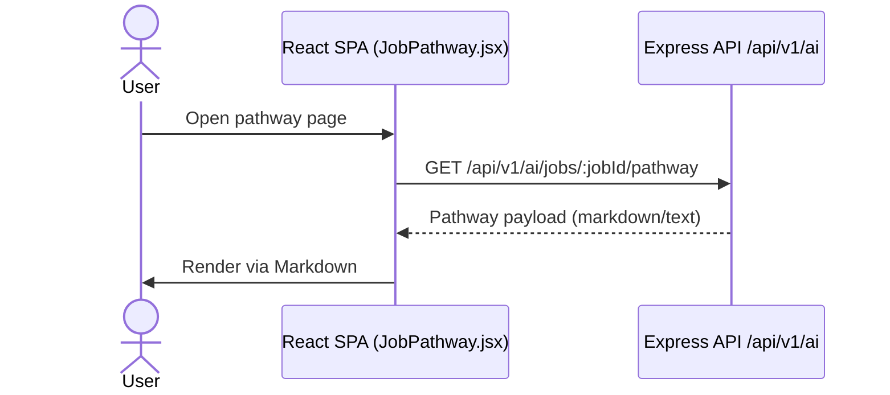

# Frontend (Vite/React SPA)

React SPA for candidate and admin experiences consuming the Express backend API.

## Architecture

## Workflows

### Job browsing and applying

### AI Career Pathway view

## Key paths

- Screens/components: `src/components/*`
- Admin screens: `src/components/admin/*`
- Redux store/slices: `src/redux/*`
- Hooks: `src/hooks/*`
- API constants: `src/utils/constant.js`
